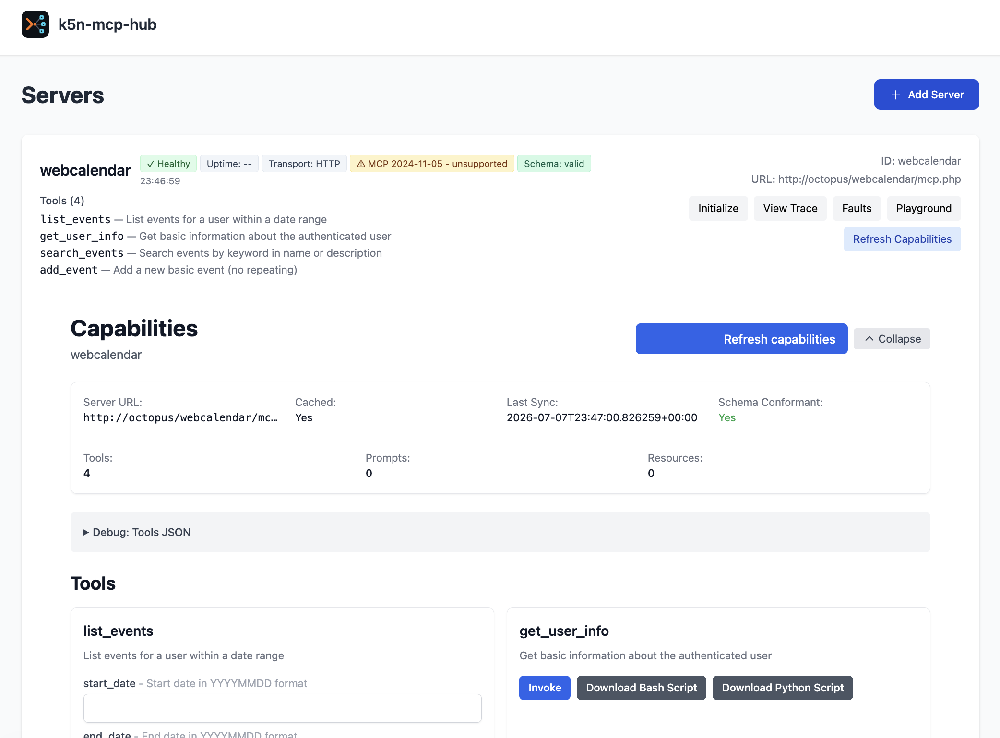

# k5n-mcp-hub


[](https://github.com/craigk5n/k5n-mcp-hub/actions/workflows/ci.yml)

## Overview

k5n-mcp-hub is a registry and management hub for MCP (Model Context Protocol) servers, built with Python and FastAPI. It provides server discovery, health monitoring, request tracing, fault injection, a reverse proxy for MCP calls, and an admin web UI.

<p align="center">
  
</p>

## Quick Start

```bash
python3 -m pip install -e .[dev]
k5n-mcp-hub
```

Then open `http://localhost:8080` in your browser.

## Run with Docker

Build the image locally (a published `k5n/k5n-mcp-hub` image on Docker Hub is planned — see `TODO.md`):

```bash
docker build -t k5n-mcp-hub .
```

Run it a few different ways:

```bash
# Default (local-first, no auth) — open http://localhost:8080
docker run --rm -p 8080:8080 k5n-mcp-hub

# Custom port
docker run --rm -p 9000:9000 -e SERVER_HTTP_PORT=9000 k5n-mcp-hub

# Reach MCP servers running on the host (localhost/LAN), Linux:
docker run --rm --network host k5n-mcp-hub

# Mount your own config
docker run --rm -p 8080:8080 -v "$PWD/config.yaml:/app/config.yaml" k5n-mcp-hub

# Enable basic auth for a shared deployment (password via env, never baked into the image)
docker run --rm -p 8080:8080 \
  -e MCPHUB_AUTH__TYPE=basic \
  -e MCPHUB_AUTH__BASIC_AUTH__REGISTER_PASS=change-me \
  k5n-mcp-hub

# JSON-file storage persisted to a named volume
docker run --rm -p 8080:8080 \
  -e MCPHUB_STORAGE__TYPE=json \
  -e MCPHUB_STORAGE__JSON__PATH=/data/servers.json \
  -v k5n_mcp_hub_data:/data k5n-mcp-hub
```

The image binds `0.0.0.0` inside the container (so a published `-p` port is reachable) and runs as a non-root user. For any internet-exposed deployment, also set `security.allow_private_networks: false` and review the security notes in `AUDIT_local.md`.

## Configuration

Configuration is loaded from `config.yaml` at the repository root. Environment variables can override config values using two patterns:

- **Bare env var** (highest priority): `SERVER_HTTP_PORT` sets the HTTP port directly.
- **Nested prefix**: Variables with the `MCPHUB_` prefix use `__` as a separator for nested keys. For example, `MCPHUB_SERVER__HTTP_PORT` sets `server.http_port`.

## MCP protocol support

The hub speaks three MCP protocol revisions and negotiates per server:

- **2026-07-28** — the *stateless* revision: no `initialize` handshake or sessions.
  The hub probes these servers with `server/discover`, fetches capabilities via
  self-contained JSON-RPC POSTs carrying the spec's `_meta` keys, health-checks
  them with `server/discover` (the `ping` method no longer exists), and honors
  `ttlMs` freshness hints when pacing background discovery. The reverse proxy
  fills in the required `Mcp-Method`/`Mcp-Name` headers for clients that omit
  them, and generated tool scripts use the single-POST stateless flow.
- **2025-11-25** and **2025-06-18** — the handshake revisions: the classic
  `initialize` → `notifications/initialized` flow with `Mcp-Session-Id` support.

Discovery records each server's negotiated revision and the admin UI shows it as
a badge: **supported**, **outdated** (older than anything the hub supports, e.g.
`2024-11-05` — still usable), or **newer than hub** (a revision the hub doesn't
know yet). Traffic proxied through the hub echoes whatever version the client
and server agreed on, so servers on other revisions still work through the proxy.

## Registering a server

Register a server with the **Add Server** button on the home page (or `POST /v1/register`). This works for both local backends and remote hosted MCP servers (for example X's server at `https://api.x.com/mcp`, using a bearer token for auth).

> **Register the exact endpoint URL, including its path.** The hub proxies the base `/mcp` route to the server URL verbatim — it does not add or strip a trailing slash. Register `https://api.x.com/mcp` (no trailing slash) for hosted servers that serve at exactly that path; register `.../mcp/` (with the slash) for SDK/Starlette-mounted servers that redirect `/mcp` to `/mcp/`, since the hub does not follow redirects. If a proxied call unexpectedly returns 404, check the trailing slash first.

## Fault Injection

Fault injection lets you deliberately make a registered MCP server *misbehave* so you can test how your own MCP client or agent copes with slow, broken, and non-conforming servers — without having to build a broken server yourself. It's a small chaos-testing harness for the MCP layer: point your client at the hub, turn on a fault, and watch how the client handles a timeout, a corrupt response, or a stream that dies mid-flight. Real-world MCP servers do fail this way, and clients that assume the happy path can hang, crash, or silently misbehave; fault injection lets you find and fix that on demand.

Faults are applied on the hub's **reverse-proxy path**: your client reaches a registered server by sending requests to the hub's `POST /mcp` endpoint with an `X-MCP-Target-Server: <server-id>` header, and when a fault is enabled the hub returns the configured failure instead of forwarding the call to the real backend. Each request triggers at most one fault, evaluated in the order shown below.

| Fault | Simulates | What the caller receives |
|---|---|---|
| **SSE Interrupt** | A streaming response that drops mid-stream | `200 text/event-stream` with a single `event: error` and no further data |
| **Timeout** | A slow or hung server | The hub waits *Timeout (ms)* (default 2000, max 60000), then returns `504` |
| **Malformed JSON** | A corrupt response body | `200` with an invalid JSON body (`{bad json`) |
| **Invalid Method Error** | A server rejecting the call | `200` with a JSON-RPC error `-32601 Method not found` |

### Using it from the admin UI

1. Register the MCP server you want to test — use the **Add Server** button on the home page (or `POST /v1/register`).
2. On that server's card, click **Faults** to open the fault-injection panel.
3. Check **Enable Fault Injection** (the master switch), then turn on the specific fault(s) you want. For a timeout, also check **Enable Timeout** and set **Timeout (ms)**.
4. Click **Save Settings**.
5. Send MCP traffic through the hub to that server from your client or agent (configured to use the hub's `/mcp` endpoint as its server URL) and observe how it reacts to the injected failure.
6. When you're finished, reopen **Faults** and uncheck **Enable Fault Injection** to return the server to normal.

> Fault injection only affects requests **proxied through the hub** — it never changes the real backend. Because it stays on until you turn it off, remember to disable it when you're done so you don't keep breaking that server's proxied traffic.

## Tests

Run the canonical local check sequence:

```bash
ruff check .
ruff format --check .
mypy --explicit-package-bases --ignore-missing-imports src
python3 -m pytest -v
```

> `python3 -m pytest` rather than a bare `pytest`, so the tests run under the same
> interpreter you installed into. A `pytest` on your `PATH` can belong to a
> different Python — in which case most of the suite still passes, but the tests
> that need the `mcp` SDK fail with `ModuleNotFoundError: No module named 'mcp'`.

## License

Released under the [MIT License](LICENSE).

## Acknowledgements

k5n-mcp-hub was originally built using the agent-dev-team tool.
